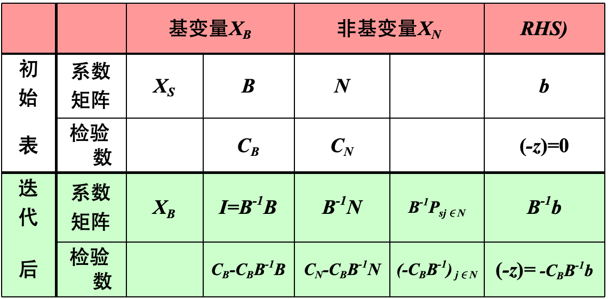
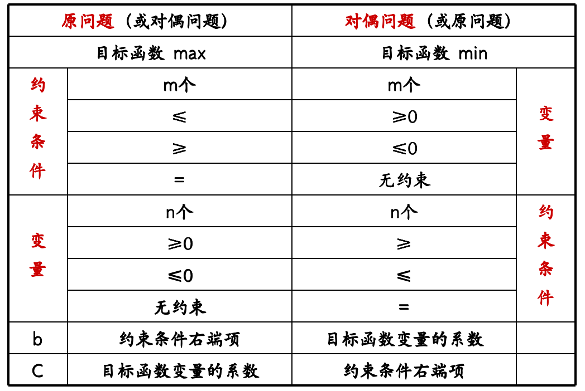

# Chapter-2对偶理论DualityTheory

## 单纯形法的矩阵描述

设线性规划的矩阵形式为
$$
\begin{array}{ll}\max z=C X & \max z=C X+C_S X_S \\ \left\{\begin{array}{l}A X \leq b \\ X \geq 0\end{array}\right. & \left\{\begin{array}{l}A X+I X_S=b \\ X, X_S \geq 0\end{array}\right.\end{array}
$$
这里 $I$ 为 $m$ 阶单位阵, $b \geq 0$. 设基变量 $X_B=X_S$, 系数矩阵 $(A, I)=(B, N)$, 其中 $B 、 N$ 分别是基变量和非基变量的系数矩阵, 则
$$
\left(\boldsymbol{X}, \boldsymbol{X}_S\right)=\left(\begin{array}{l}
\boldsymbol{X}_B \\
\boldsymbol{X}_N
\end{array}\right),\left(\boldsymbol{C}, \boldsymbol{C}_S\right)=\left(\boldsymbol{C}_B, \boldsymbol{C}_N\right)
$$
目标函数 $\max z=C X=\left(C_B, C_N\right)\left(\begin{array}{l}X_B \\ X_N\end{array}\right)$
$$
=C_B X_B+C_N X_N
$$

约束条件 
$$
(B, N)\left(\begin{array}{l}X_B \\ X_N\end{array}\right)=B X_B+N X_N=b
$$
非负条件 $\boldsymbol{X}_B, \boldsymbol{X}_N \geq 0$

由(4)式知 $B X_B=b-N X_N$
$$
\boldsymbol{X}_B=\boldsymbol{B}^{-1} \boldsymbol{b}-\boldsymbol{B}^{-1} \boldsymbol{N} \boldsymbol{X}_N
$$

上式代人(3)式得
$$
\begin{gathered}
z=C_B\left(B^{-1} b-B^{-1} N X_N\right)+C_N X_N \\
=C_B B^{-1} b+\left(C_N-C_B B^{-1} N\right) X_N
\end{gathered}
$$
令 $\boldsymbol{X}_N=0$, 得 $\boldsymbol{X}_B=\boldsymbol{B}^{-1} \boldsymbol{b}$, 有

基可行解 $\boldsymbol{X}^{(1)}=\left(B^{-1} b, 0\right)^T$, 目标函数值 $z=C_B B^{-1} b$

最小规则的表达式是
$$
\theta=\min _i\left[\frac{\left(B^{-1} b\right)_i}{\left(B^{-1} P_k\right)_i} \mid\left(B^{-1} P_k\right)_i>0\right]=\frac{\left(B^{-1} b\right)_l}{\left(B^{-1} P_k\right)_l}
$$

### 改进单纯形法

- 单纯形法的迭代过程实质上是从一组基到另一组基的变换
- 在每次迭代过程中不必要地计算了很多与迭代无关的数字, 影响了计算效率
- 而每次迭代中真正有用的数字是基变量列数字、基的逆矩阵、非基变量检验数，以及最大正检验数所对应的非基变量系数列向量。

改进单纯形法的步骤：

1. 根据LP问题的标准型，确定初始基变量和初始可行基B。求逆矩阵$B^{-1}$，得到初始基可行解$X_{B} = B^{-1}b$，$X_N = 0$
2. 计算单纯形算子$\pi = C_BB^{-1}$和目标函数值$z = C_BB^{-1}b = \pi b$
3. 计算非基变量检验数$\sigma_N = C_N-C_BB^{-1}N = C_N-\pi N$
   - 若$\sigma_N$都小于0，说明已经达到最优解==（没有可以换入基的变量使目标函数变大）==
   - 若不是，进入下一步
4. 根据max{$\sigma_j$ | $\sigma_j > 0$} = $\sigma_k$来选择入基变量$x_j$，计算$B^{-1}P_k$，若$B^{-1}P_k$小于0，问题没有最优解，否则进入下一步
5. 根据$\theta=\min _i\left[\frac{\left(B^{-1} b\right)_i}{\left(B^{-1} P_k\right)_i} \mid\left(B^{-1} P_k\right)_i>0\right]=\frac{\left(B^{-1} b\right)_l}{\left(B^{-1} P_k\right)_l}$，选择出基变量$x_l$
6. 用$P_l$代替$P_k$得到新基$B_1$，计算$B_{1}^{-1}$，转入第一步
7. 直到找到最优解

## 对偶问题

对偶问题的提出非常巧思，比如说周长一定，面积最大的二维图形是圆，那该问题的对偶问题就是面积一定，周长最小的图形是圆。

在生产中，我们常常提出资源一定，让获得利润最大化，那该问题的对偶问题就是要获得多少利润时，怎么才能让消耗资源最少。

==但大多数情况下，对偶问题是解释不了现实意义的，但是对偶问题为我们解决特定问题问题提供了一种比较方便的思路。==

想必读者在看过本文之前已经知道许多关于对偶问题的知识，所以这里仅做总结概括。

原问题和对偶问题存在着如下关系：

例：

$\begin{gathered}\max z=2 x_1+3 x_2 \\ \begin{cases}2 x_1+2 x_2 \leq 12 &  \\ x_1+x_2 \leq 8 & \\ 4 x_1 \leq 16 &  \\ 4 x_2 \leq 12 &  \\ x_1, x_2 \geq 0 & \end{cases} \end{gathered}$

求该问题的对偶问题

$\begin{gathered}\min w=12 y_1+8 y_2+16 y_3+12 y_4 \\ \left\{\begin{array}{c}2 y_1+y_2+4 y_3 \geq 2 \\ 2 y_1+2 y_2+4 y_4 \geq 3 \\ y_i \geq 0(i=1,2,3,4)\end{array}\right.\end{gathered}$

**用矩阵形式表示：**

(1) $\max z=C X$ $\leftarrow \cdots-\cdots \min w=Y b$

s.t. $\left\{\begin{array}{c}A X \leq b \\ X \geq 0\end{array}\right.$ s.t. $\left\{\begin{array}{c}Y A \geq C \\ Y \geq 0\end{array}\right.$

(2) $\max z=C X$ $\leftarrow-\cdots----\rightarrow \min w=Y b$

s.t. $\left\{\begin{array}{c}A X \geq b \\ X \geq 0\end{array}\right.$s.t. $\left\{\begin{array}{c}Y A \geq C \\ Y \leq 0\end{array}\right.$

(3) $\max z=C X$ $\leftarrow-\cdots---\rightarrow \min w=Y b$

s.t. $\left\{\begin{array}{c}A X \leq b \\ X \leq 0\end{array}\right.$s.t. $\left\{\begin{array}{c}Y A \leq C \\ Y \geq 0\end{array}\right.$

上述规则均应用于严格定义的对偶问题, 也称为对称对偶问题

它满足两个条件:

(1) 所有变量非负: 即 $X>0, Y>0$

(2) 约束条件均为同向不等式, 若原问题约束条件均为 $\leq$, 则它的对偶问题的约束条件均为 $\geq$ ==当原问题的约束条件的符号不完全相同时, 也存在对偶问题, 这种对偶问题称为非对称对偶问题。==

## 对偶性质

1. 对偶问题的对偶是原问题

2. 弱对偶性：若X是原问题的可行解，Y是对偶问题的可行解，则存在CX<=Yb

3. 无界性：若原问题（对偶问题）为无界解，则对偶问题（原问题）无可行解

   ==但是原问题为无可行解时，对偶问题可能是无可行解也可能是无界解==

4. 可行解是最优解时的性质：设 $\bar{X}$ 是原问题的可行解, $\bar{Y}$ 是对偶问题的可行解，当 $C \bar{X}=\bar{Y} b$ 时， $\bar{X}, \bar{Y}$ 分别是原问题与对偶问题的最优解。

5. 若原问题有最优解，那么对偶问题也有最优解，且目标函数相等

6. 互补松弛理论：在线性规划问题的最优解中，如果对应某一约束条件的对偶变量值为非零，则该约束条件取严格等式；反之，如果约束条件取严格不等式，则其对应的对偶变量一定为 0

## 对偶单纯形法

==对偶单纯形法不是求解对偶问题的单纯形法==

对偶单纯形法是根据对偶原理和单纯形法的原理而设计出来求解原线性规划问题的一种方法， 采用的技术是在原问题的单纯形表格上进行对偶处理

对偶单纯形法步骤：

1、列初始单纯性表, 使得所有检验数 $\sigma_j \leq 0$

2、出基变量: 取 $\min \left\{\mathrm{b}_i<0\right\}=\mathrm{b}_1 \longrightarrow \mathrm{x}_{(1)}$

3、 入基变量: $\min \left\{\frac{c_j-z_j}{a_{1 j}} \mid a_{1 k}<0\right\}=->x_k$,

4、 主元素: [a $\left.\mathrm{a}_{1 \mathrm{k}}\right]$

5、迭代: 同单纯形法, 新单纯表种 $\mathrm{p}_{\mathrm{k}}$ 化为单位向量