# Chapter-3运输问题TransportationProblem

## 问题引入

如图所示，Ai表示产地，Bj表示销地，表中元素代表Ai—>Bj的单位运价，产量销量如表所示。

**问题：应如何调运可使总运输费用最小？**

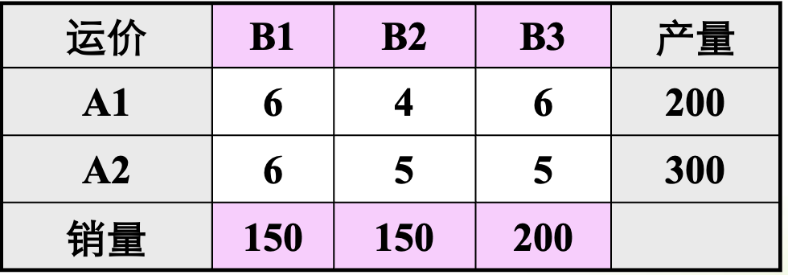

Solution：

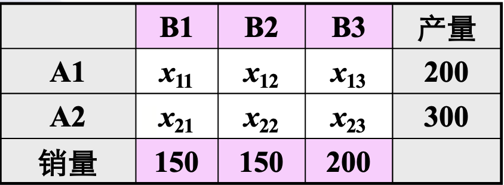

$\begin{aligned} & \min z=6 x_{11}+4 x_{12}+5 x_{13}+6 x_{21}+5 x_{22}+5 x_{23} \\ & \left\{\begin{array}{l}x_{11}+x_{12}+x_{13}=200 \\ x_{21}+x_{22}+x_{23}=300 \\ x_{11}+x_{21}=150 \\ x_{12}+x_{22}=150 \\ x_{13}+x_{23}=200 \\ x_{i j} \geq 0, i=1,2 ; j=1,2,3 .\end{array}\right.\end{aligned}$

## 通用模型

### 产销平衡表和单位运价表

产销平衡表和单位运价表可以合二为一。

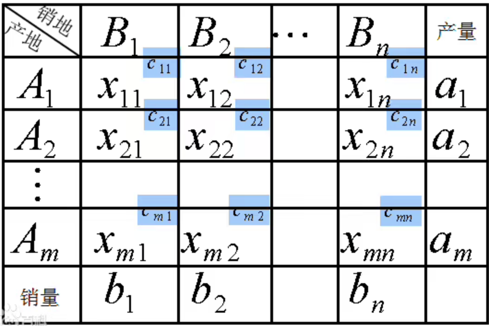

### 数学模型

1. 产销平衡

   $\begin{gathered}\min z=\sum_{i=1}^m \sum_{j=1}^n C_{i j} X_{i j} \\ \left\{\begin{array}{c}\sum_{j=1}^n X_{i j}=S_i \quad i=1,2, \ldots, m \\ \sum_{i=1}^m X_{i j}=d_j \quad j=1,2, \ldots, m \\ X_{i j} \geq 0\end{array}\right.\end{gathered}$

2. 产大于销

   $\begin{gathered}\min z=\sum_{i=1}^m \sum_{j=1}^n C_{i j} X_{i j} \\ \left\{\begin{array}{c}\sum_{j=1}^n X_{i j} \leq S_i \quad i=1,2, \ldots, m \\ \sum_{i=1}^m X_{i j}=d_j \quad j=1,2, \ldots, m \\ X_{i j} \geq 0\end{array}\right.\end{gathered}$

3. 产小于销

   $\begin{gathered}\min z=\sum_{i=1}^m \sum_{j=1}^n C_{i j} X_{i j} \\ \left\{\begin{array}{c}\sum_{j=1}^n X_{i j}=S_i \quad i=1,2, \ldots, m \\ \sum_{i=1}^m X_{i j} \leq d_j \quad j=1,2, \ldots, m \\ X_{i j} \geq 0\end{array}\right.\end{gathered}$

这就是运输问题的数学模型。它包含*m×n*个变量，(*m+n*)个约束方程。其系数矩阵的结构比较松散，且特殊。 

## 表上作业法

单纯形法可以解决运输问题，但是可以使用基于单纯形法的表上作业法，求解效率更高。该方法可分为三步：

1. 第一步：求出初始基可行解（初始运调方案），即在产销平衡表中给出m+n-1个数字格。==（最小元素法，Vogel法）==
2. 第二步：求非基变量（空格）的检验数并判断是否得到最优解。若已得最优解，停止计算，否则转第三步。==（闭回路法，位势法）==
3. 第三步：换基，对原运量进行调整得到新的基可行解，转入第二步==（闭回路法）==

### 第一步：求出初始基可行解

#### 最小元素法

所谓最小元素，是指作业表中的最小运价𝐶𝑖𝑗。即先给最小运价那格安排运量，然后花去该运价所在行或列；直到求出初始方案为止。

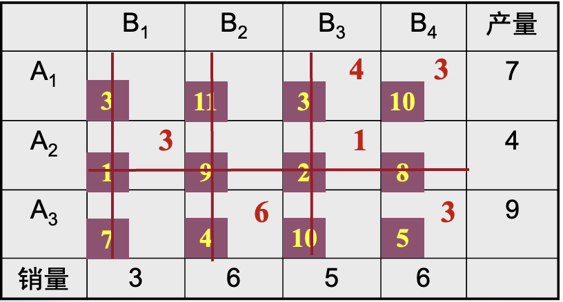

如图所示，最小元素法操作的过程如下：

1. 最小运价为1，用A2为B1调运，4大于3，划去B1列，4剩余1
2. 最小运价为2，用A2为B3调运，1小于5，划去A2行，5剩余4
3. 最小运价为3，用A1为B3调用，7大于4，划去B3列，7剩余3
4. 最小运价为4，用A3为B2调运，9大于6，划去B2列，9剩余3
5. 最小运价为5，用A3为B4调运，3小于6，划去A3行，6剩余3
6. 最小运价为10，用A1为B4调运，7大于3，填入3

#### Vogel法

元素差额法对最小元素法进行了改进，考虑到产地到销地的最小运价和次小运价之间的差额，如果差额很大，就选最小运价先调运，否则会增加总运费。

Vogel法给出的初始解比最小元素法更接近最优解。

计算步骤如下：

1. 对每行每列的运价 $C_{i j}$ 分别计算两最小元素之差 (取正值), 将“行差”记于表右侧，“列差” 基于表下端

2. 在所有行差、列差中选一最大差额, 若有几个同时最大, 则可任选其中之一

3. 在最大差额所在行（列）中选一最小运价, 若有几个同时最小,则可任选其一。

4. 在所确定的最小运价格子内, 确定基变量数值并画圈, 然后划去所在的行或列, 具体做法同最小元素法

5. 对剩余未划去的行列重复上述步骤，但当只剩下最后一行(列)时, 不在计算行 (列) 差, 而直接按最小元素法分配运量并划去相应的行或列。

   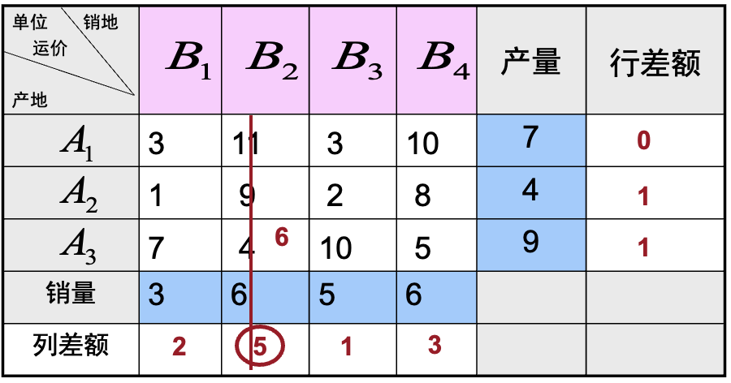

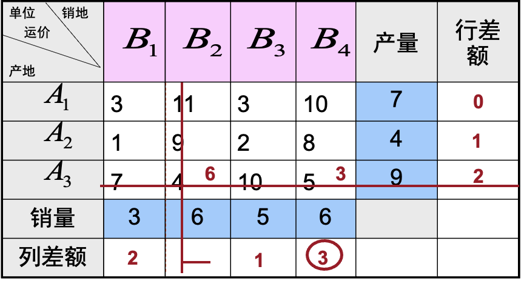

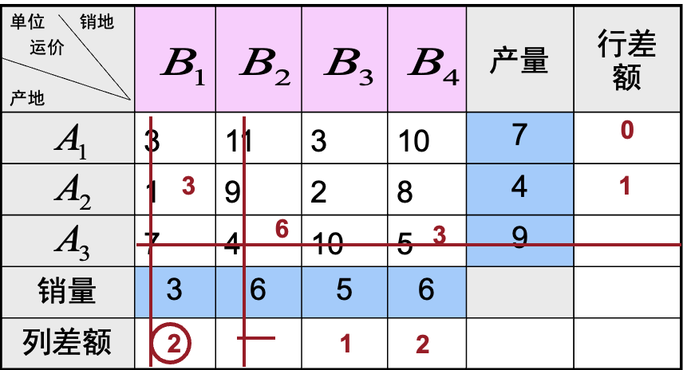

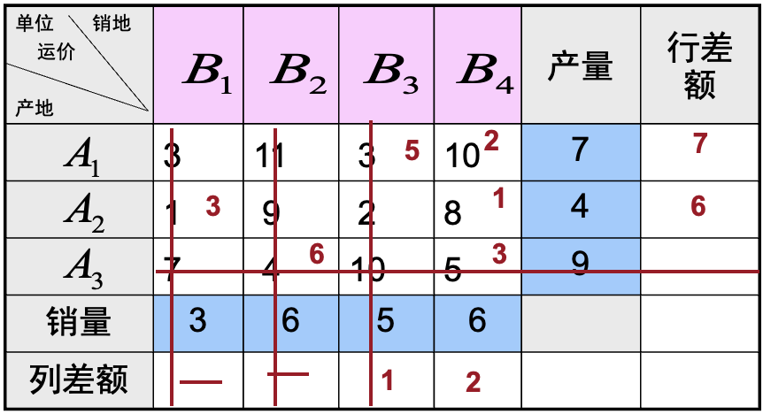

### 第二步：最优解的判别（计算检验数）

#### 闭回路法

闭回路是以某空格为起点。用水平或垂直线向前划，当碰到一数字格时可以转90°后，继续前进，直到回到起始空格为止。闭回路如下图的(a),(b),(c)等所示。

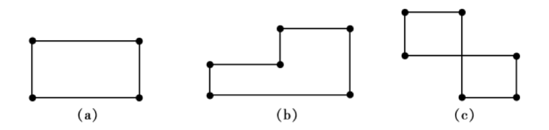

假设初始基可行解如下所示。

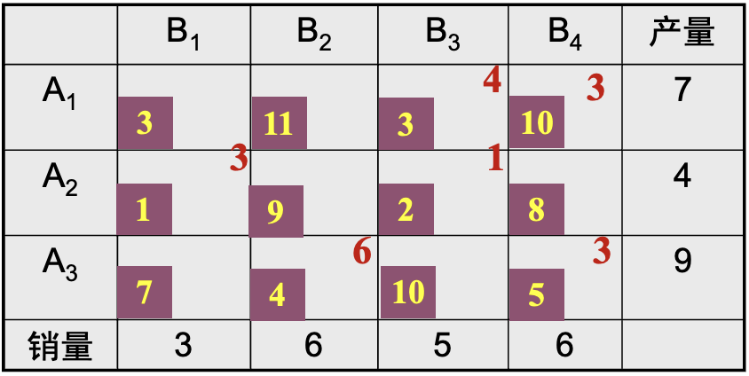

在已给出初始解的表中，可从任一空格如(A1，B1)出发，若A1的产品调运1吨给B1。为了保持产销平衡，就要依次调整：(A1，B3)处减少1吨，(A2，B3)处增加1吨，(A2，B1)处减少1吨，即构成了以空格为起点，其他为数字格的闭回路。

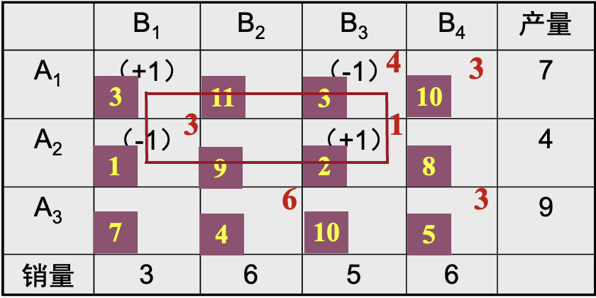

调整的方案会让运费增加(+1) *3+(-1) *1+(+1) *2+(-1) *3 = 1元，所以(A1, B1)的检验数为1

当所有检验数中还有负数的时候==（意味着还可以通过换基使得运费减少）==，就说明当前的解还不是最优解。

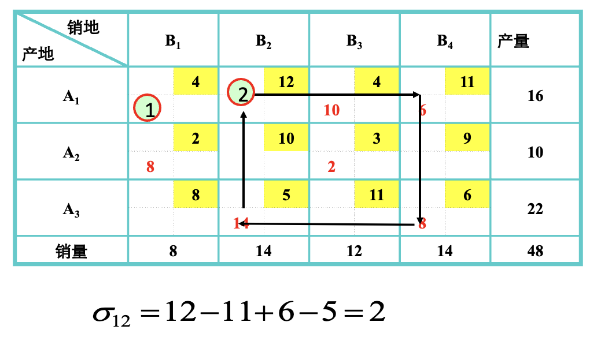

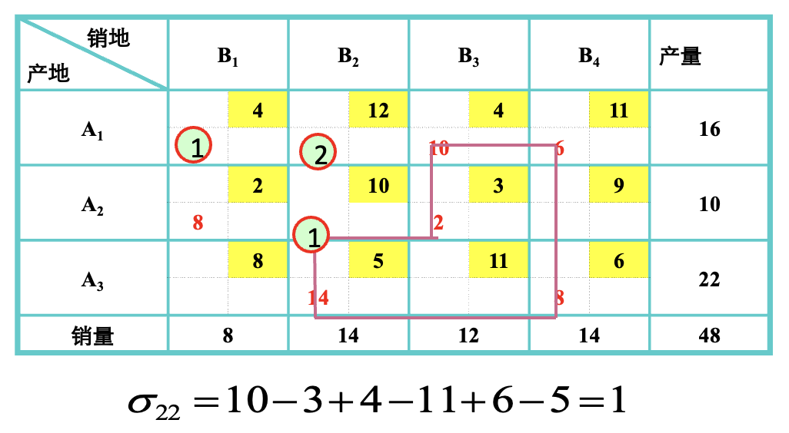

#### 位势法

计算行位势和列位势

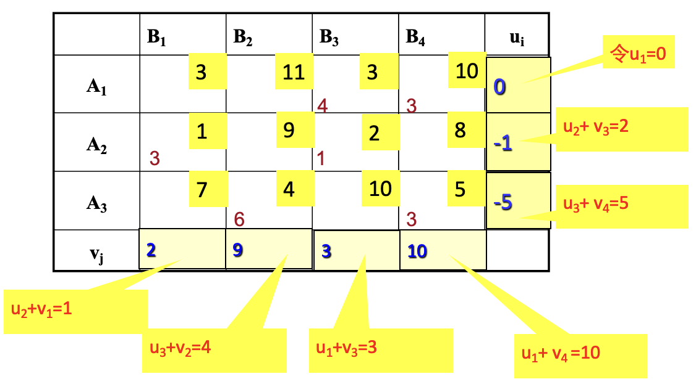

计算检验数

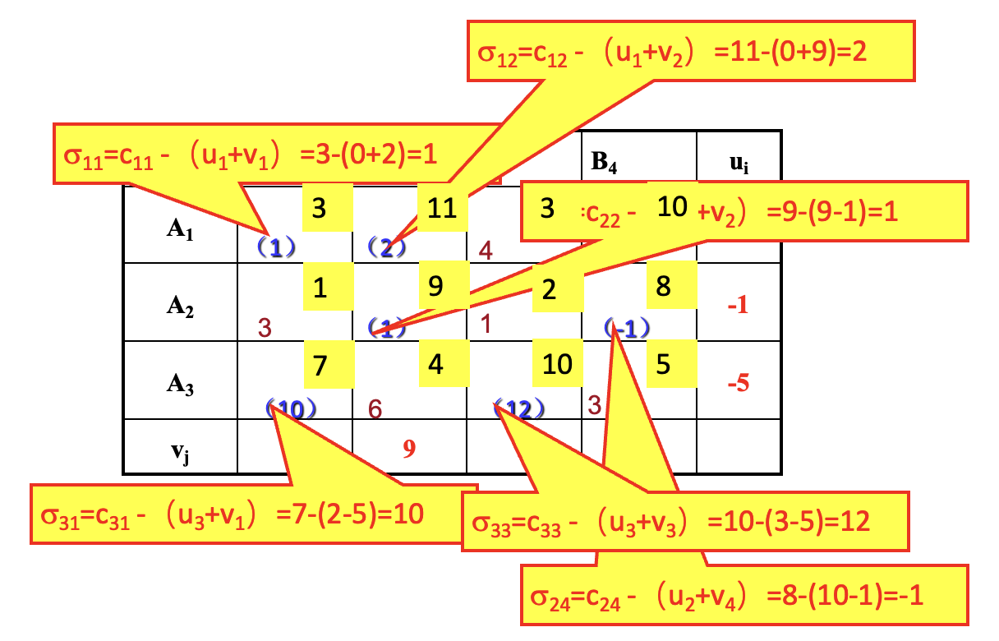

### 解的改进

1. 确定换入基的变量：

   当在表中空格处出现负检验数时，表明未得最优解。若有两个和两个以上的负检验数时，==一般选其中最小的负检验数==，以它对应的空格为调入格。即以它对应的非基变量为换入量。

2. 确定换出基的变量：

   以进基变量xik为起点的闭回路中，==标有负号的最小运量作为调整量θ，θ对应的基变量为出基变量==，并打上“×”以示换出作为非基变量。

(2，4)为调入格。以此格为出发点，作一闭回路，按顺序对每个顶点标记+1、-1, (2，4)格的调入量*θ*是选择闭回路上具有(-1)的数字格中的最小者。即*θ*=min(1,3)=1(其原理与单纯形法中按θ规划来确定换出变量相同)。

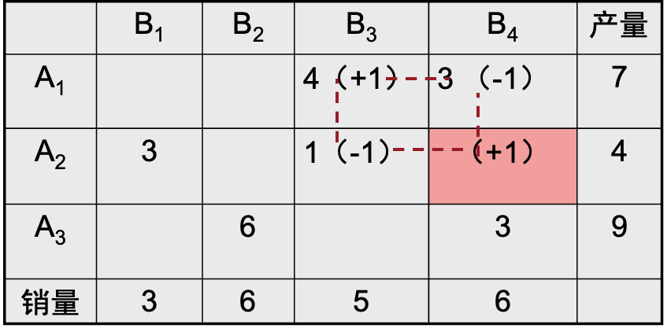

调整步骤为：在进基变量的闭回路中标有正号的变量加上调整量*θ*，标有负号的变量减去调整量*θ*，其余变量不变，得到一组新的基可行解。然后求所有非基变量的检验数重新检验。

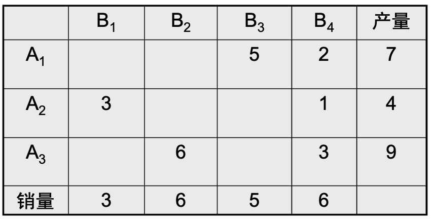

如图，(2, 4):0+1=1, (2, 3):1-1=0, (1, 3):4+1=5, (1, 4):3-1=2

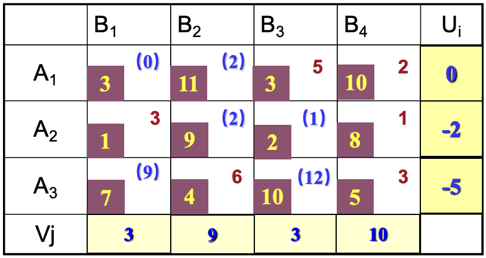

再用闭回路法或位势法求各空格的检验数，表中的所有检验数都非负，则当前方案为最优方案，此时最小总运费：

Z =(1×3)＋(4×6)＋(3×5)＋(2×10)＋(1×8)＋(3×5)＝85元

## 表上作业法补充说明

1. 若运输问题的某一基可行解有多个非基变量的检验数为负，在继续迭代时，取它们中任一变量为换入变量均可使目标函数值得到改善，但通常取 $\sigma_{\mathrm{ij}}<0$ 中最小者对应的变量为换入变量。

2. 无穷多最优解产销平衡的运输问题必定存最优解。如果非基变量的 $\sigma_{\mathrm{ij}}$ $=0$, 则该问题有无穷多最优解。

3. 退化解:

   ※表格中一般要有 $(\mathrm{m}+\mathrm{n}-1)$ 个数字格。但有时在分配运量时则需要同时划去一行和一列, 这时需要补一个 0 , 以保证有 $(m+n-1)$个数字格作为基变量。==一般可在划去的行和列的任意空格处加一个 0 即可。(通常选一个单位运价最小的空格)==

   ※利用进基变量的闭回路对解进行调整时, 标有负号的最小运量 (超过 2 个最小值) 作为调整量 $\theta$, 选择任意一个最小运量对应的基变量作为出基变量, 并打上“ $X$ ”以示作为非基变量。当出现退化解后, 可能在某闭回路上有标记为 $(-1)$ 的取值为 0 的数字格, 这时应取调整量 $=0$.

4. 产销不平衡转化成产销平衡：

   求下列表中极小化运输问题的最优解。 

   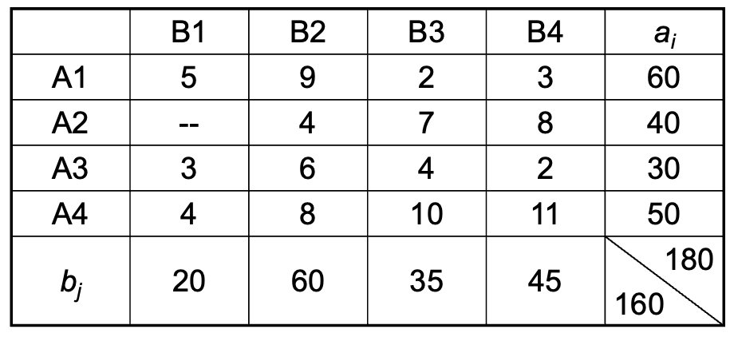

   表中A2不可达B1，用一个很大的正数M表示运价C21。虚设一个销量为b5=180-160=20，Ci5=0，i=1,2,3,4，表的右边增添一列 ，得到新的运价表。

   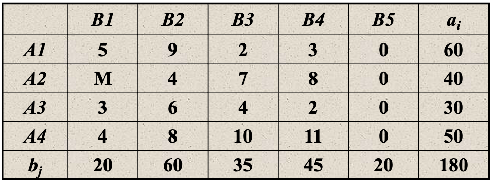

5. 求极大值问题

   将极大化问题转化为极小化问题。设极大化问题的运价表为 $C$, 用一个较大的数 $M\left(M \geq \max \left\{c_{i j}\right\}\right)$ 去减每一个 $c_{i j}$ 得到矩阵 $\mathrm{C}^{\prime}$, 其中 $C^{\prime}=\left(M-c_{i j}\right) \geq 0$, 将 $C^{\prime}$ 作为极小化问题的运价表，用表上用业法求出最优解。

   下列矩阵C是Ai(I=1，2，3)到Bj的吨公里利润,运输部门如何安排运输方案使总利润最大。

   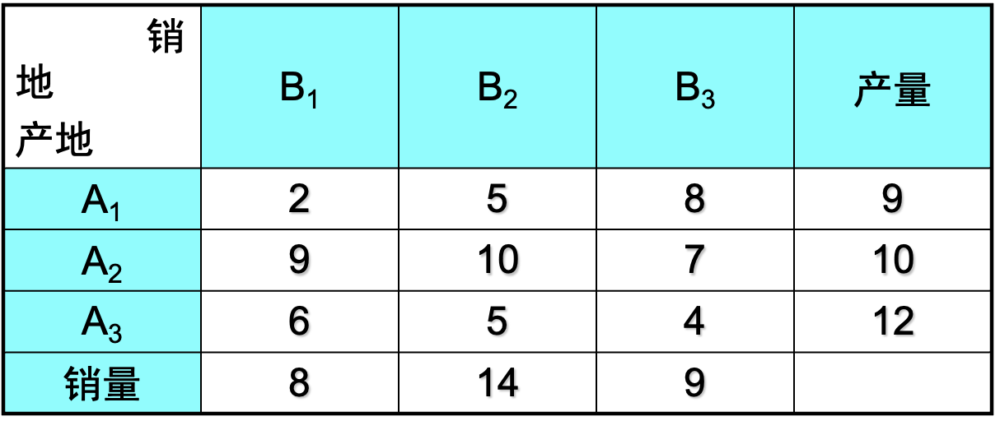

   M取10

   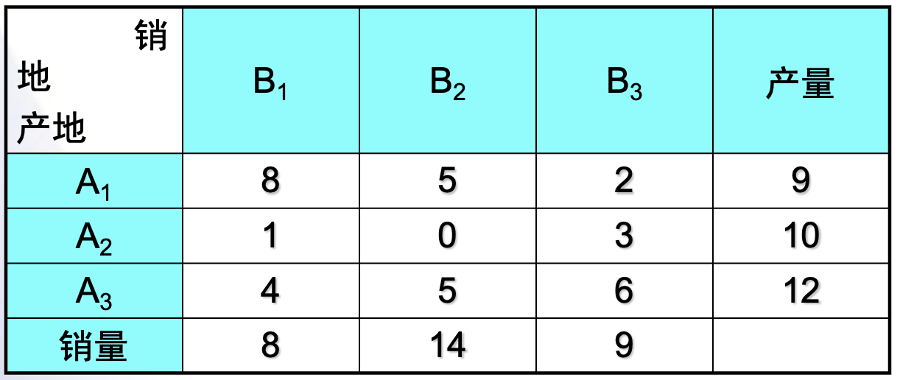

## 小结

- 表上作业法

  1. 每一步骤如何操作

  2. 和单纯形法类别，检验数，调整方法原理

- 建模思路

  1. 供需关系——产地销地

  2. 产销不平衡处理