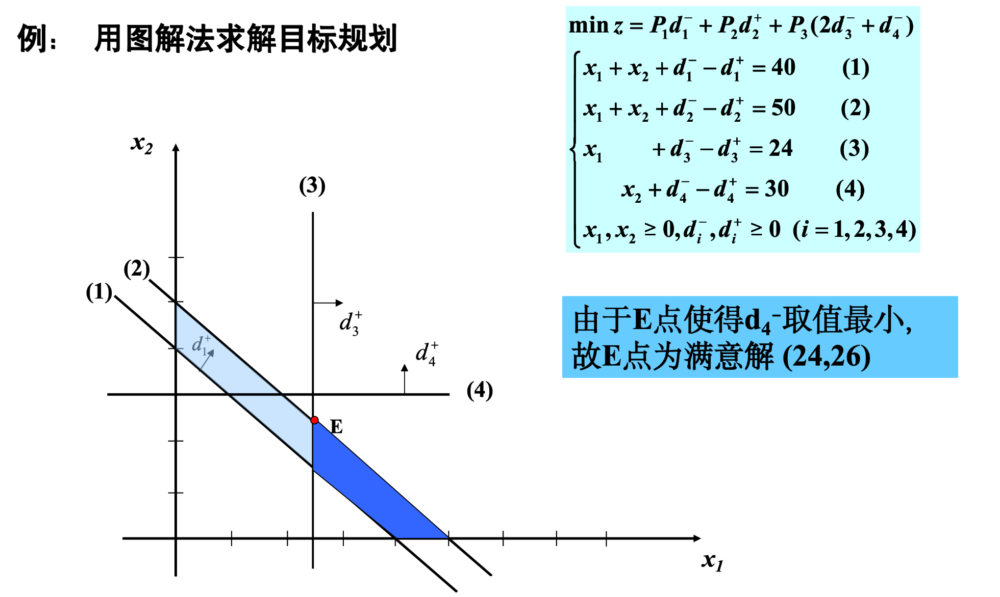
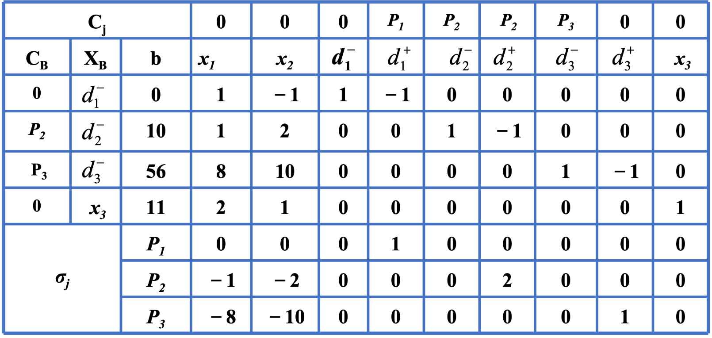
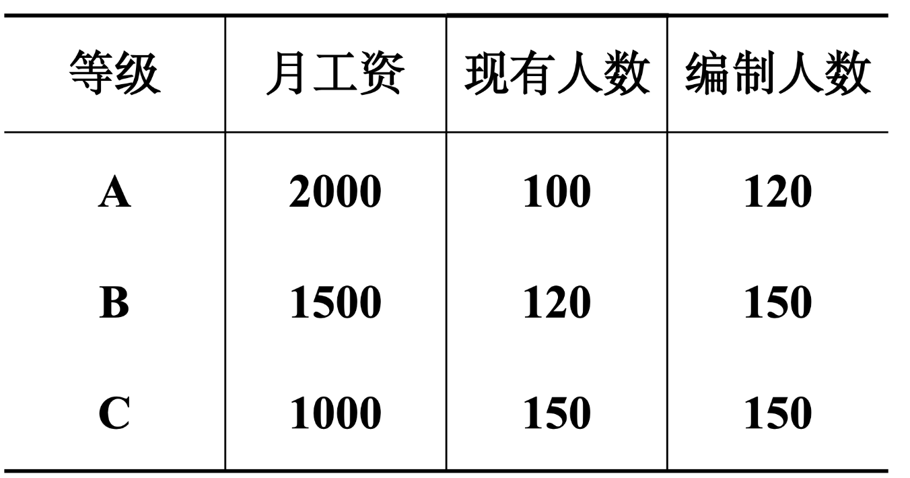
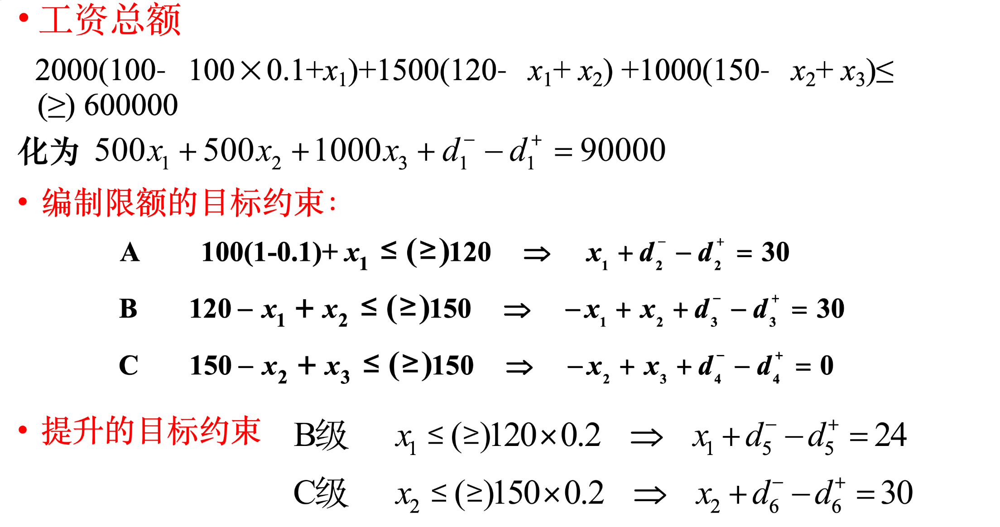
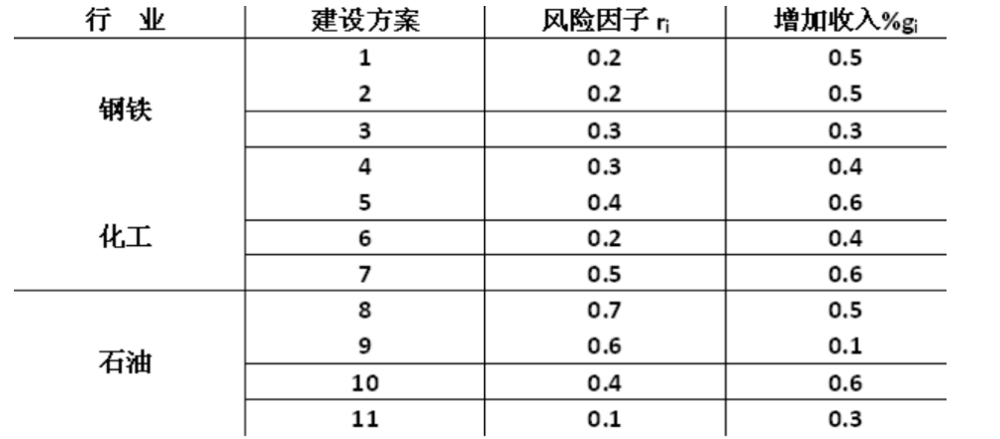

# Chapter-4目标规划GoalPrograming

## 目标规划问题的提出

==目标规划==是在==线性规划==的基础上，为了适应经济管理多目标决策的需要而由线性规划逐步发展起来的一个分支。

例：某企业计划生产甲，乙两种产品, 这些产品分别要在A,B,C,D四种不同设备上加工。按工艺文件规定，如表所示。

|          |  $\mathbf{A}$  | $\mathbf{B}$ |  $\mathbf{C}$  |  $\mathbf{D}$  |   单件利润   |
| :------: | :------------: | :----------: | :------------: | :------------: | :----------: |
|    甲    |  $\mathbf{1}$  | $\mathbf{1}$ |  $\mathbf{4}$  |  $\mathbf{0}$  | $\mathbf{2}$ |
|    乙    |  $\mathbf{2}$  | $\mathbf{2}$ |  $\mathbf{0}$  |  $\mathbf{4}$  | $\mathbf{3}$ |
| 最大负荷 | $\mathbf{1 2}$ | $\mathbf{8}$ | $\mathbf{1 6}$ | $\mathbf{1 2}$ |              |

问该企业应如何安排计划，使得计划期内的总利润收入为最大?

解：设甲、乙产品的产量分别为 $\mathrm{x}_1, \mathrm{x}_2$, 建立线性规划模型:
$$
\begin{aligned}
& \max z=2 x_1+3 x_2 \\
& \text { s.t }\left\{\begin{array}{rr}
2 x_1+2 x_2 & \leq 12 \\
x_1+2 x_2 & \leq 8 \\
4 x_1 & \leq 16 \\
4 x_2 & \leq 12 \\
x_1, x_2 & \geq 0
\end{array}\right.
\end{aligned}
$$

其最优解为 $x_1=4, x_2=2, z^*=14$ 元

但企业的经营目标不仅仅是利润, 而且要考虑多个方面,如:

(1) 力求使利润指标不低于 12 元;

(2) 考虑到市场需求, 甲、乙两种产品的生产量需保持 $1: 1$ 的比例;

(3) C 和D为贵重设备，严格禁止超时使用;

(4) 设备B必要时可以加班, 但加班时间要控制; 设备A 即要求充分利用, 又尽可能不加班。

要考虑上述多方面的目标，需要借助目标规划的方法。

## 目标规划的建模

1. 设置偏差变量

   用$d^+$代表超过目标的偏差，称为正偏差变量；，用$d^-$代表未达到目标的偏差，称为负偏差变量

   正负偏差必须有一个为0，因为实际值不能既超过目标值又小于目标值

   当实际值超出目标值时： $\mathbf{d}^{+}>0, \mathbf{d}=\mathbf{0}$;
   当实际值未达到目标值时： $\mathbf{d}^{+}=0, d->0$;
   当实际值同目标值恰好一致时： $\mathrm{d}^{+}=\mathbf{0}, \mathrm{d}^{-}=\mathbf{0}$;

2. ==构建目标约束==

   对于严格限制的资源使用建立系统约束，等同于线性规划中的约束条件（硬约束）

   对于不严格限制的约束，连同原线性规划建模时的目标，通过目标约束来表达（软约束）

   - 甲乙的产量相同，即x1-x2 = 0，实际值与目标值恰好相同，则$\mathbf{x}_1-\mathbf{x}_2+\mathbf{d}^{-}-\mathbf{d}^{+}=0$

     $\left\{\begin{array}{l}\min \left\{d^{+}+d^{-}\right\} \\ x_1-x_2+d^{-}-d^{+}=0\end{array}\right.$

   - 甲的产量不低于乙的产量，x1-x2 >= 0，即d+大于0，希望d-=0或者说尽可能小

     $\left\{\begin{array}{l}\min \left\{d^{-}\right\} \\ x_1-x_2+d^{-}-d^{+}=0\end{array}\right.$

   - 甲的产量低于乙的产量，x1-x2<0，即d-大于0，希望d+=0或者说尽可能小

     $\left\{\begin{array}{l}\min \left\{d^{+}\right\} \\ x_1-x_2+d^{-}-d^{+}=0\end{array}\right.$

3. ==目标的优先级与权系数==

   在一个目标规划的模型中, 为达到某一目标可牺牲其他一些目标, 称这些目标是属于不同层次的优先级。优先级层次的高低可分别通过优先因子 $\mathbf{P}_1, \mathbf{P}_2, \cdots$ 表示。对于同一层次优先级的不同目标, 按其重要程度可分别乘上不同的权系数。权系数是一个个具体数字, 乘上的权系数越大, 表明该目标越重要。

   通常来说 P1>>P2>>P3

   所以上述目标规划的模型可以表示为

   $\begin{aligned} & \min z=P_1 d_1^{-}+P_2\left(d_2^{+}+d_2^{-}\right)+ P_3\left(d_3^{+}+d_3^{-}\right)+P_3 d_4^{+} \\ & \text {s.t. }\left\{\begin{array}{l}4 x_1 \leq 16 \\ 4 x_2 \leq 12 \\ 2 x_1+3 x_2+d_1^{-}-d_1^{+}=12 \\ x_1-x_2+d_2^{-}-d_2^{+}=0 \\ 2 x_1+2 x_2+d_3^{-}-d_3^{+}=12 \\ x_1+2 x_2+d_4^{-}-d_4^{+}=8 \\ x_1, x_2, d_i^{-}, d_i^{+} \geq 0(i=1, \ldots, 4)\end{array}\right.\end{aligned}$

4. 满意解

   后面的图解法就会很形象的说明，有可能Pj+1时割平面后就没有解空间了，这时候Pj时就是满意解

   换句话说，优先级越高的目标可以保证实现或部分实现，但是后面的目标就不一定能保证实现。

5. 三种目标函数

   - 要求恰好达到目标值，比如要求甲乙生产的数目相等

     $\min Z=f\left(d^{+}+d^{-}\right)$

   - 要求不超过目标值，比如要求甲生产的不能超过乙

     $\min Z=f\left(d^{+}\right)$

   - 要求超过目标值，比如要求甲生产的要超过乙

     $\min Z=f\left(d^{-}\right)$

## 目标规划的图解法

与线性规划的图解法十分相似，我总结为以下几步：

1. 画出硬约束的解空间
2. 在图上画出软约束的约束曲线，处于临界位置，用箭头标出正负偏差变量增大的方向，得到割后的解空间
3. 按照约束的优先级求出满足约束的解
4. 如果所有的约束都能满足那自然最好，但是如果求到某一优先级Pj+1不能满足，则上一约束Pj时的解就是最优解

## 目标规划的单纯形法

本质上和普通的单纯形法没有本质上的区别

用一个例子来说明即可。

例：用单纯形法求解下列目标规划问题
$$
\begin{aligned}
& \min Z=P_1 d_1^{+}+P_2\left(d_2^{+}+d_2^{-}\right)+P_3 d_3^{-} \\
& \left\{\begin{array}{cc}
x_1-x_2+d_1^{-}-d_1^{+}=0 \\
x_1+2 x_2+d_2^{-}-d_2^{+}=10 \\
8 x_1+10 x_2+d_3^{-}-d_3^{+}=56 \\
2 x_1+x_2 & \leq 11 \\
x_{1-2} \geq 0, d_j^{+} \cdot d_j^{-} \geq 0 \quad(j=1.2 .3)
\end{array}\right. \\
&
\end{aligned}
$$
转化为标准型

$\begin{aligned} & \text { m in } Z=P_1 d_1^{+}+P_2\left(d_2^{+}+d_2^{-}\right)+P_3 d_3^{-} \\ & \left\{\begin{array}{cc}x_1-x_2+d_1^{-} & -d_1^{+}=0 \\ x_1+2 x_2+d_2^{-} & -d_2^{+}=10 \\ 8 x_1+10 x_2+d_3^{-}-d_3^{+}=56 \\ 2 x_1+x_2+x_3 & =11 \\ x_{1-3} \geq 0, d_j^{+} \cdot d_j^{-} \geq 0 \quad(j=1.2 .3)\end{array}\right.\end{aligned}$

建立初始单纯形表

可以发现这里检验数按照优先级分成了三行，实际上检验数仍然可以表示成一个整式，但是因为存在着P1>>P2>>P3的关系，所以分成了三行，在空格处填入的量应该是检验数中Pj前的参数，我们选择换入变量时，是先比较P1，如果P1相等再去比较P2。

出基的原则仍然和普通单纯形法一致，就是选择$\theta$最小的作为出基变量

## 实际目标规划应用

1. 升级调薪模型

   例：某单位升级计划如下：

   

   1、不能超过月工资总额600000元；
   2、提级时，每级的定编人数不能超过;
   3、升级面不超过现有人数的 $20 \%$ ，但尽可能多提；
   4、 C 级不足的人数可用新职工补足；$\mathrm{A}$ 级将有 $10 \%$ 的人要退休, 退休后工资由福利基金中开支。

   解：

   设 $x_1$ 表示由B级提升到 $\mathrm{A}$ 级的人员数；$x_2$ 表示由 $\mathrm{C}$ 级提升到 $\mathrm{B}$ 级的人员数;$x_3$ 表示新录用 $\mathrm{C}$ 级的人员数。

   根据规定优先因子:

   $p_1$ 不超过工资总额;

   $p_2$ 各级人员不超编;

   $p_3$ 升级面 $\leqslant 20 \%$, 但尽可能多提。

   

   目标函数：
   $$
   \min z=p_1\left(d_1^{+}\right)+p_2\left(d_2^{+}+d_3^{+}+d_4^{+}\right)+p_3\left(d_5^{+}+d_5^{-}+d_6^{+}+d_6^{-}\right)
   $$

2. 投资计划模型

   某经济特区的计委有一笔资金，在下一个计划期内可向钢铁、化工、石油等行业投资建新厂。这些工厂能否预期建成是一定风险的，在建成投产后，其收入与投资额有关，经过分析研究，各工厂的建设方案的风险因子及投产后可增收入的百分比例如表所示。 

   

   计委根据该地区情况提出以下要求：用于钢铁的投资额不超过总资金的35%；用于化工的投资额至少占总资金的15%；用于石油的投资不超过总资金的50%。并且，首先要考虑总风险不超过0.2；其次考虑总收入至少要增长0.55%；然后再考虑各项投资的总和不能超过总资金额，现在要确定对不同行业的各投资历方案所占的比例。 

   解：

   (1) 确定决策变量: 假设 $x_i$ 为第汸案投资金的百分比, 且总的投资比例为 $100 \%$;

   (2) 确定绝对约束:

   1）用于钢铁工业的投资额不超过总资金的 $35 \%$ ：
   $$
   x_1+x_2+x_3+x_4 \leq 0.35
   $$
   2）用于化工工业的投资额至少占总资金的 $15 \%$ :
   $$
   x_5+x_6+x_7 \geq 0.15
   $$
   3）用于石油工业的投资额不超过总资金的 $50 \%$ ：
   $$
   x_8+x_9+x_{10}+x_{11} \leq 0.5
   $$
   (3) 确定目标约束:

   1）总风险不超过0.2, 为第一优先级, 赋予有限因子 $p_1$ : ==小于== d+ = 0
   $$
   \sum_{i=1}^{11} r_i x_i+d_1^{-}-d_1^{+}=0.2
   $$
   2）总收入至少要增长 $0.55 \%$, 为第二优先级，赋予有限因子 $p_2$ : ==大于== d- = 0
   $$
   \sum_{i=1}^{11} g_i x_i+d_2^{-}-d_2^{+}=0.55
   $$
   3）各项投资不能超过总投资金额，为第三优先级，赋予有限因子 $p_3$ : ==小于== d+ = 0
   $$
   \sum_{i=1}^{11} x_i+d_3^{-}-d_3^{+}=1
   $$
   (4)建立目标函数, 完成模型:
   $$
   \min Z=p_1 d_1^{+}+p_2 d_2^{-}+p_3 d_3^{+}
   $$

3. 

