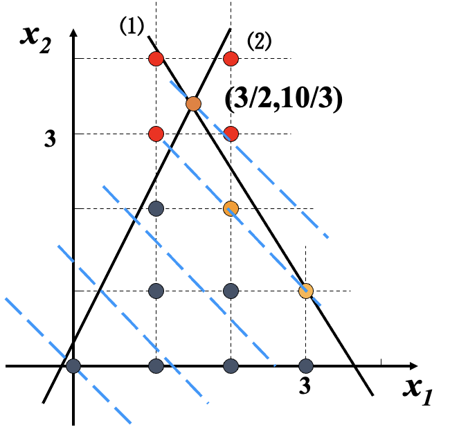
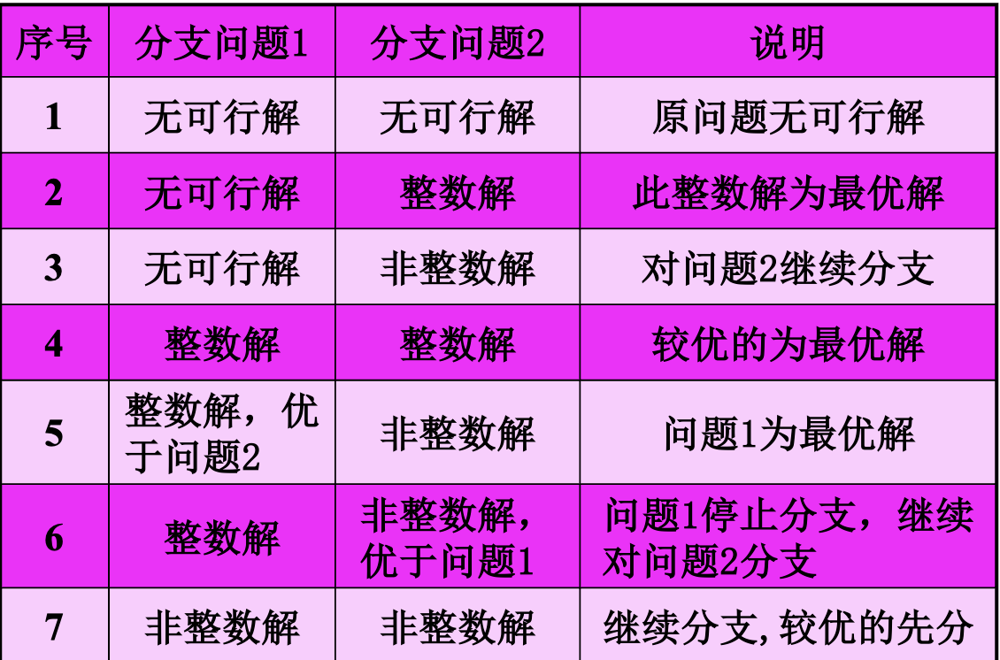
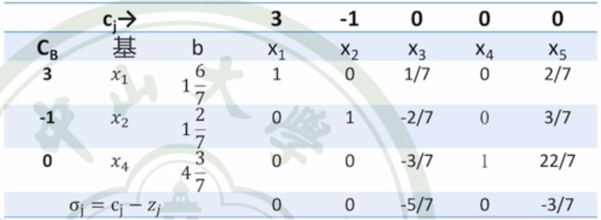
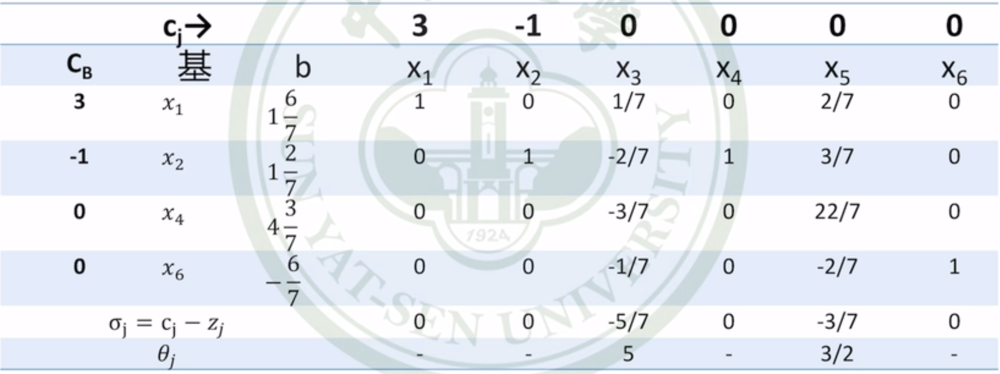
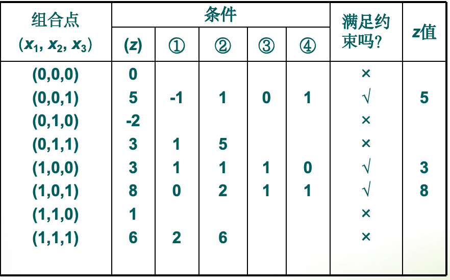
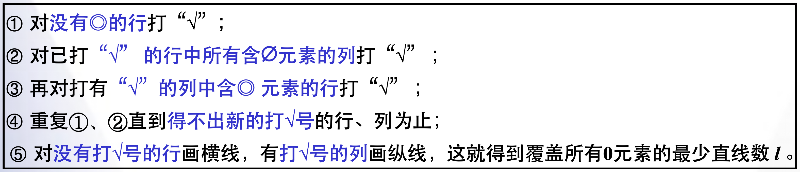

# Chapter-5整数线性规划IntegerLinearPrograming

## 整数线性规划问题的提出

该问题属于是线性规划，但是要求部分决策变量或全部决策变量取整数。分类有以下几种：

1. 纯整数线性规划
2. 混合整数线性规划
3. 0-1整数线性规划

整数规划的数学模型可以表示为以下：
$$
\begin{aligned} & \max (\min ) z=\sum_{j=1}^n c_j x_j \\ & \text { s.t. }\left\{\begin{array}{l}\sum_{j=1}^n a_{i j} x_j \leq(=, \text { or } \geq) b_i, i=1,2, \cdots, m \\ x_j \geq 0, j=1,2, \cdots, n \\ x_1, x_2, \cdots, x_n \in Z\end{array}\right.\end{aligned}
$$
例：设整数规划问题如下：

先写出松弛问题，即==不考虑整数约束==

用图解法求出最优解为：x1＝3/2, x2 = 10/3，且有Z = 29/6

在可行域中找出所有的整数点，然后分别求目标函数值，最终(2,2),(3,1)点的目标函数值最大，即为Z=4。

**IP和LP的联系：**

(1)如果LP的最优值在其可行域T的某个顶点上达到,则相应的IP最优值,在T中去掉不含整数点的区域后的T*中的整数点上达到.

(2)==对于求最大化(最小化)问题,LP最优解对应的目标函数值,是相应的IP最优解对应的目标函数值的上界(下界).==

## 求解方法

1. 分支定界法
2. 割平面法
3. 隐枚举法
   1. 分支隐枚举
   2. 过滤隐枚举

## 分支定界法

步骤如下：

1. 求整数规划的松驰问题最优解;

   若松驰问题的最优解满足整数要求, 得到整数规划的最优解, 否则转下一步;

2. 分支与定界:
    任意选一个非整数解的变量xi, 在松驰问题中加上约束:

  $x i \leq[x i]$ 和 $x i \geq[x i]+1$

  组成两个新的松驰问题，称为分枝。新的松驰问题具有特征: ==当原问题是求最大值时，目标值是分枝问题的上界; 当原问题是求最小值时，目标值是分枝问题的下界。==

  检查所有分枝的解及目标函数值，若某分枝的解是整数并且目标函数值大于 (max)等于其它分枝的目标值，则将其它分枝剪去不再计算, 若还存在非整数解并县目标值大于(max)整数解的目标值, 需要继续分枝, 再检查, 直到得到最优解。

一些原则：

## Gomory割平面法

如果是多维决策变量的话，分支定界就显得很麻烦，所以用割平面法解决。

步骤如下：

1. 求出当前松弛问题的最优单纯形表：

   

   b都是非整数，所以需要构造约束方程。

   约束方程构造的原则是：==选择非整数部分最大的b，上表为1又6/7==，构造如下方程：
   $$
   \sum_{j \in K}\left(-f_{i_0, j}\right) x_j \leq-f_{i_0}
   $$
   其中 $f_{i_0, j}$ 是非基变量的小数部分，而 $f_{i_0}$ 是基变量取值的小数部分

   构造方程如下：
   $$
   -\frac{1}{7} x_3-\frac{2}{7} x_5 \leq-\frac{6}{7}
   $$
   加入松弛变量
   $$
   -\frac{1}{7} x_3-\frac{2}{7} x_5 + x_6= -\frac{6}{7}
   $$
   得到表：

   

   由于有b小于0，所以用==对偶单纯形法==进行求解，获得新的最优单纯形表

   如果得到的所有b都是整数，则说明当前已经是最优解，否则继续构造方程进行迭代。

## 0-1规划

0-1变量通常用于表示系统是否处于某状态，表示的是逻辑关系。

解决0-1规划问题有两种方法，一种是过滤隐枚举法，一种是分支隐枚举法

### 过滤隐枚举法

[例]已知整数规划模型为

目标函数 $\max z=3 x_1-2 x_2+5 x_3$

约束条件 $x_1+2 x_2-x_3 \leq 2$

$x_1+4 x_2+x_3 \leq 4$

$x_1+x_2 \leq 3$

$4 x_2+x_3 \leq 6$

$x_1, x_2, x_3$ 为 0 或 1

先用试探法求出一个可行解，例如（x1,x2,x3）= （1，0，0）是一个可行解，z=3。因为是求极大值问题，所以目标值小于3的解不用检验是否满足约束条件，所以现在可以加入一个过滤条件
$$
3 x_1-2 x_2+5 x_3 \geq 3
$$

该式称为过滤条件(Filtering Constraint), 凡是排列组合所得的目标 $z<3$ 者全被滤掉，故称过滤隐枚举法。

过滤隐枚举法可以改进，对于目标下界取为3，凡是大于3的组合全进行约束检验。实际可在运算中加以修改，应以到目前为止出现的最大可行解目标值作为以后运算的过滤条件。

## 指派问题

### 匈牙利法

步骤：

1. 变换系数矩阵，增加0元素

2. 试指派（找独立0元素）

3. 额外处理

   

4. 变换矩阵以增加0元素

5. 试指派