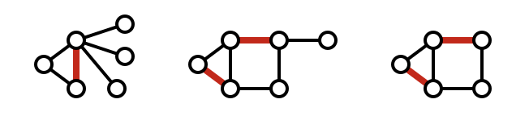
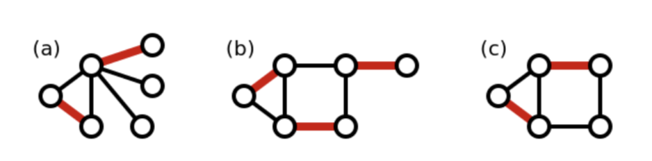
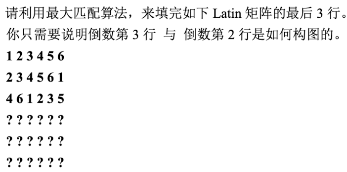
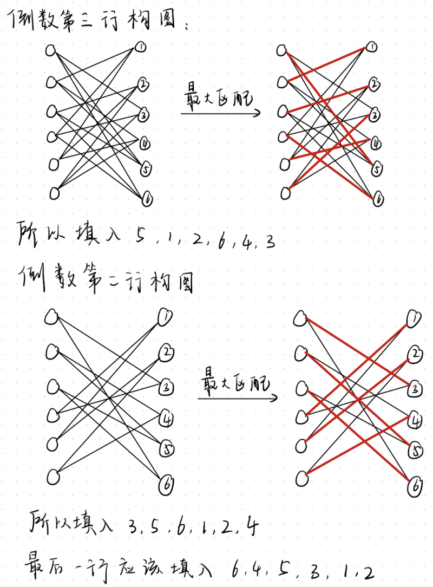
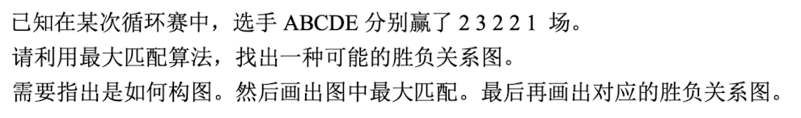
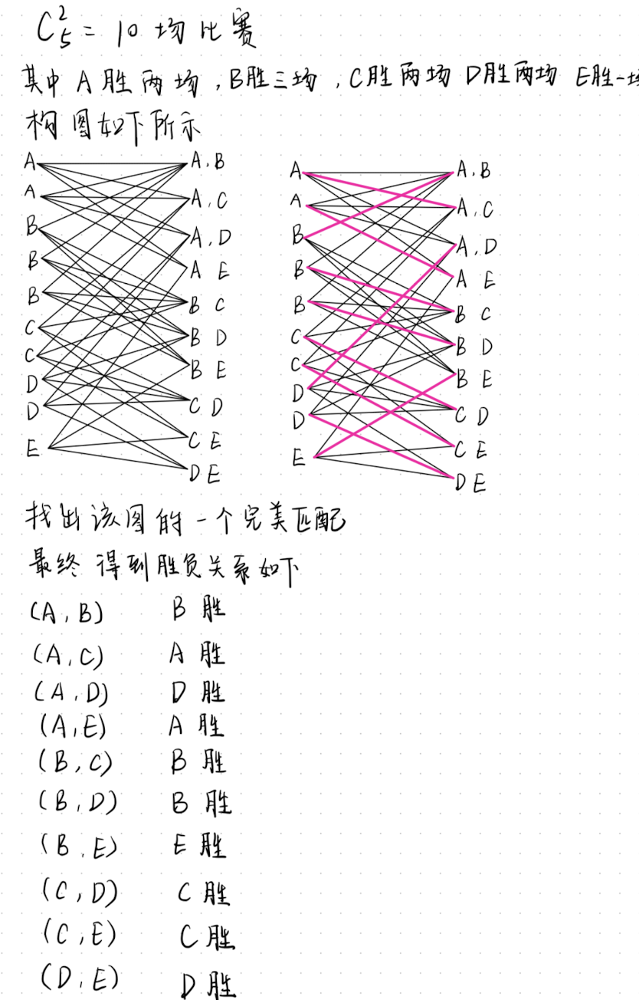

# Chapter-6最大匹配问题&Hall's Thm

## [匹配](https://zh.wikipedia.org/wiki/匹配_(图论))&最大匹配

给定无向图G = (V, E)，若M $\subseteq$ E，且M中的边的顶点各不相同，则M叫做一个匹配

如图所示的三种情况都为各自图中的一个匹配。

极大匹配是指无法通过增加未包括在内的边来扩大的匹配。这意味着，如果你试图向极大匹配中添加任何其他边，新加入的边都会与现有匹配中的至少一条边共享一个顶点，从而违反了匹配的定义。

所以上图中的三种情况都属于极大匹配。

图 $G$ 的一个最大匹配是另一个概念, 指边数最多的匹配。**最大匹配可能有不止一个, 但最大匹配的边数是确定的, 并且不可能超过图中顶点数的一半。**这是因为一个匹配中的一条边对应一对 (两个) 顶点, 而不同边所对应的两对顶点是完全不同的, 否则它们就是相邻的两条边了。最大匹配中的顶点数称为图的 “配对数”, 一般记作 $\nu(G)$ 。最大匹配显然都是极大匹配, 但极大匹配不一定是最大匹配。以下三幅图是最大匹配的例子。可以看出, 在左起第一幅图中, 最大匹配的顶点数是 4 , 但在上面的极大匹配的例子中, 存在着只有 1 条边的极大匹配。左起第二幅图中也是一样, 最大匹配的顶点数是 6 , 但在上面的极大匹配的例子中, 存在着只有 2 条边的极大匹配。左起第三幅图则是一个“最大匹配必然是极大匹配”的例子。

图*G*的一个**完美匹配**（*Perfect Match*）是一个包括了图*G*中原来的所有顶点的匹配，是最大匹配的一种。一般来说，最大匹配不一定使用了原图的所有顶点，因此配对数小于等于原图的顶点数目，比如说上面左起第一和第三幅图。而第二幅图则是一个完美匹配的例子。完美匹配有时也叫做全局匹配或完全匹配。完美匹配同时也是一个原图的最小边数的边覆盖（即是用最少的边包括所有顶点的子图）

## 增广轨

在一个图中，假设已经有了一个匹配（即一些不相交的边集合）。增广轨是一条交替路径，这条路径的起点和终点都是未匹配的顶点（即这两个顶点不是现有匹配中任何边的一部分），并且路径上的边交替地属于匹配内和匹配外。如果在一个匹配中找到了一条增广轨，那么可以通过“翻转”这条路径上的匹配状态（即将匹配中的边变为非匹配的，将非匹配的边变为匹配中的）来增加匹配中的边的数量。这意味着原来的匹配不是最大匹配。

用数学语言的表示如下：

设  $M \subseteq E$ 是 G  上的一个匹配。增广轨 \( P \) 的定义如下：

1. $P$ 是 $G$ 中的一条简单路径, 即路径上的顶点不重复。
2. 设 $P$ 的顶点序列为 $v_1, v_2, \ldots, v_k$ 。那么 $v_1$ 和 $v_k$ （即 $P$ 的起点和终点）都是未匹配的点。
3. $P$ 上的边交替地属于匹配内和匹配外，且第一条边是未匹配的边。

增广轨的存在表明当前匹配  M  不是最大匹配。通过“翻转”增广轨  P  上边的匹配状态，可以得到一个更大的匹配。

## Thm 1 M有增广轨$\Leftrightarrow$M不是最大匹配

[证明](https://en.wikipedia.org/wiki/Berge%27s_theorem)分为两部分：

1. If a matching $M$ is maximum, then there is no augmenting path relative to the matching $M$ :

   Assume there is an augmenting path $P$ relative to the maximum matching $M$. The augmenting path $P$ will have one more edge not in $M$ than edges in $M$. A new matching $M^{\prime}$ can be created by combining the edges of $M$ that are not in $P$ with the edges of $P$ that are not in $M$. This results in $M^{\prime}$ having one more edge than $M$, contradicting the assumption that $M$ is a maximum matching.

2. If there is no augmenting path relative to the matching $M$, then the matching $M$ is maximum:

   Assume there is a matching $M^{\prime}$ with a greater number of edges than $M$. Consider the symmetric difference $Q=M \oplus M^{\prime}$, which will consist of paths and cycles. Since $M^{\prime}$ has more edges than $M$, there must be at least one path in $Q$ with more edges from $M^{\prime}$ than $M$. Such a path, being alternating, will have unsaturated initial and final vertices with respect to $M$, making it an augmenting path for $M$, contradicting the initial assumption.

## 二分图的最大匹配算法

算法框架：

1. 令M为一个空匹配
2. 不断寻找M得增广轨并用它来增广
3. 直到M无增广轨时，M为最大匹配

**如何找一条增广轨？**

定义交错轨，起点为G中未匹配的点，经过的边交替地属于匹配内和匹配外，且第一条边是未匹配的边，**但不要求终点是X未匹配的点**，所以增广轨为特殊的交错轨，因为要求终点是Y中未匹配的点。

求出交错轨可达的全部点的集合，若该集合中包含Y中未匹配的点，则找到一条增广轨。

## Thm 2 Hall's Thm（最大匹配的一个重要定理）

Hall's 定理（也称为Hall's Marriage Theorem）是图论中关于二分图最大匹配的一个重要定理。它提供了一个必要且充分的条件, 用于判断一个二分图是否存在完美匹配 （perfect matching），即是否可以找到一个匹配来覆盖图中的每一个顶点。

Hall's 定理的陈述:

设 $G=(X, Y, E)$ 是一个二分图，其中 $X$ 和 $Y$ 是顶点集合， $E$ 是边集合。Hall's 定理指出, 存在一个 $X$ 到 $Y$ 的完美匹配（**或者说G有|X|的匹配，即X中的点都在匹配中**）的充分必要条件是：对于 $X$ 中的任意子集 $S$,其邻接顶点集 $N(S)$ 的大小至少与 $S$ 一样大。用数学表达即：
$$
\forall S \subseteq X,|N(S)| \geq|S|
$$

这里, $N(S)$ 表示与 $S$ 中顶点相邻的所有顶点的集合。

定理的直观解释：

这个定理可以用“婚姻”问题来类比：如果 $X$ 和 $Y$ 分别代表两个不同的群体（比如男士和女士），那么要让每个男士都找到一个女士结婚（即完美匹配），必须满足：对于任意一组男士, 知道的女士的数量至少和这组男士的数量一样多。如果有任何一组男士认识的女士人数少于这组男士的数量, 那么这组男士中至少有一个人找不到配偶。

## 练习

1. 证明二分图每个顶点的度数都为k，则一定有完美匹配

2. Latin方

   
   

3. 循环赛中，胜负场次的可能性

   
   
