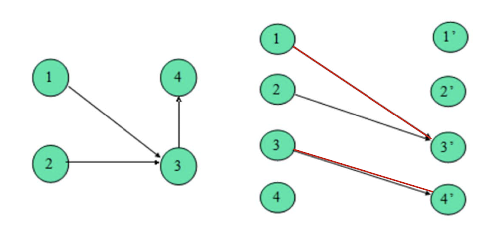

# Chapter-7最大匹配问题的应用&Dilworth定理

## 二分图的最大独立集问题&最小覆盖集问题——Konig定理

考虑无向图G = (V, E) 以及V的一个子集X

- **独立集**：如果X中的节点是相互独立的（互相之间没有边）
- **覆盖集**：如果E中任意一条边都与X相关（至少有一个顶点在X中）

问题1:找到G的最大独立集

问题2:找到G的最小覆盖集

==问题1和问题2等价，因为独立集和覆盖集相互之间是补集的关系==

容易混淆的概念：覆盖集与支配集

- 支配集：对于V中的一个子集X，如果X的补集中任意顶点都与某个X中的顶点相连，那么X称为G的一个支配集

## [Konig's Thm](https://en.wikipedia.org/wiki/Kőnig%27s_theorem_(graph_theory))

该定理分为两部分：

- **最小覆盖集的大小等于最大独立集的大小**
- **最小覆盖集的大小等于最大匹配的大小**

证明如下：

The proof that the size of the minimum vertex cover equals the size of the maximum matching in bipartite graphs is a fundamental result in graph theory, rooted in Kőnig's theorem. To construct a proof, one can start by understanding the properties of matchings and vertex covers in bipartite graphs:

1. **Maximum Matching**: A matching in a graph is a set of edges without common vertices. A maximum matching is the matching with the largest possible number of edges.
2. **Minimum Vertex Cover**: A vertex cover of a graph is a set of vertices such that each edge of the graph is incident to at least one vertex of the set. A minimum vertex cover is the vertex cover with the smallest possible number of vertices.

The proof can be approached by demonstrating that for any maximum matching in a bipartite graph, there exists a corresponding vertex cover of the same size. This involves the identification of alternating paths and augmenting paths, which are key concepts in the theory of matchings. In a bipartite graph, an augmenting path relative to a matching is a path that alternates between edges in the matching and edges not in the matching, starting and ending at unmatched vertices.

The process generally involves the following steps:

- Start with a maximum matching in the bipartite graph.
- Identify specific vertices and edges that are involved in the matching and those that are not.
- Construct a vertex cover based on these identified vertices and edges.

The size of this vertex cover will be equal to the size of the maximum matching. The reasoning is that no vertex in a vertex cover can cover more than one edge of the matching, so if a vertex cover with the same number of vertices as the matching can be constructed, it must be a minimum cover.

This equivalence between the maximum matching and minimum vertex cover in bipartite graphs is not only a pivotal theoretical result but also has practical implications in various fields like computer science, operations research, and combinatorics.

Konig‘s定理为我们找一个二分图的最大独立集或最小覆盖集提供了一种解决思路，就是找到该图中的最大匹配。

最大匹配可以用Chapter-6中提到的二分图最大匹配算法。

## 有向无环图的最小路径覆盖问题

问题：给定一个有向无环G，求G的minimum path cover

构图如下，进行拆点

观察： G'的 任何一个 匹配M 恰好对应着 G的一个Path cover P。且 $P$ 中路径个数等于 $n-|M|$ 。因此找 $G$ 的最小路径覆盖, 转化为 找 $G^{\prime}$ 的最大匹配。

## 偏序集

定义：偏序集Partial Order Set满足以下条件的二元关系R的集合

- 传递性: $(x, y),(y, z)$ 属于 $R$, 则 $(x, z)$ 属于 $R$.
- 自反性: $(\mathrm{x}, \mathrm{x})$ 属于 $\mathrm{R}$
- 反对称性: 若 $(x, y)(y, x)$ 都属于 $R$ ，则 $x=y$.

Poset和DAG的联系：

1. **Poset是一个DAG**
2. **Poset是DAG的传递闭包**

**传递闭包是什么？**

**对于一个有向图 $G=(V, E)$, 其中 $V$ 是顶点集, $E$ 是边集, $G$ 的传递闭包是一个新图 $G^{\prime}=\left(V, E^{\prime}\right)$, 其中 $E^{\prime}$ 包含 $E$ 的所有边, 并且对于 $G$ 中任意两个顶点 $u$ 和 $v$ ，如果存在从 $u$ 到 $v$ 的路径（==可能经过很多次中转==），则 $(u, v) \in E^{\prime}$ 。**

## Dilworth定理

在任何有限偏序集中，最大反链（antichain，即==集合中任意两元素都不可比的元素集==）的大小等于最小链分解（chain decomposition，即==将偏序集分解为若干完全可比的子集，每个子集称为链==）的大小。这里，反链的大小是指其元素的数量，而链分解的大小是指它包含的链的数量。偏序集的宽度定义为反链和链分解的通用大小。这个定理在无穷偏序集中也有类似的说法，当存在有限多链的分解，或者反链的大小存在有限上界时，最大反链和最小链分解的大小仍然相等。

数学语言表示如下：

在一个有限的Poset(S, $\leq$)中，
$$
MinChainCover(S) = MaxAntiChain(S)
$$
