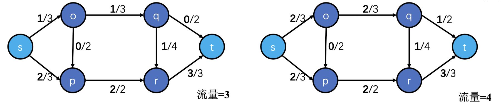

# Chapter-8最大流问题和最小割问题

## 问题描述

给定有向图 $\mathrm{G}=(\mathrm{V}, \mathrm{E})$ 。顶点集合 $\mathrm{V}$ 中包含两个特殊点 $\mathrm{s}, \mathrm{t}$ ，分别叫做源点和汇点。边集 $\mathrm{E}$ 上的一个非负函数 $c: \mathrm{E} \rightarrow \mathrm{R}_{\geq 0}$ ；
$c(\mathrm{e}) \geq 0$ 叫做 e的容量 (capacity)。

### 最大流问题

满足以下条件的函数 $f: \mathrm{E} \rightarrow \mathrm{R}_{\geq 0}$ 称作可行流 或简称 流 (flow)

- $0 \leq f(\mathrm{e}) \leq c(\mathrm{e}) \quad$ (容量条件)
- 对于 $v$ 不属于 $\{\mathrm{s}, \mathrm{t}\} ， \sum_{\mathrm{u}} f(u, v)=\sum_u f(v, u)$ (平衡条件)。等价的说, 流入 $\mathrm{v}$ 的流量 $=$ 流出 $\mathrm{v}$ 的流量; 即, $\mathrm{v}$ 点的“只是中转, 不圆积、不消耗.此时, $f(\mathrm{e})$ 称作e的流量(flow)。

而 $\sum_u f(s, u)-\sum_u f(u, s)=\sum_u f(u, t)-\sum_u f(t, u)$ 称作 $\boldsymbol{f}$ 的流量。记作|f|

流量最大的可行流称为最大流，最大流问题就是求给定网络(G, s, t, c)的最大流f

### 最小割问题

若 $V$ 被划分为 $S$ 与 $T$, 其中 $S$ 含 $s$ 且 $T$ 含 $t$ 。则 $(S, T)$ 称为一个割 (cut)。定义 $\operatorname{Cut}(\mathrm{S}, \mathrm{T})=\sum_{u \in S, v \in T} c(u, v)$ 叫做此割的容量。==(特别注意, 只算 $\mathrm{S} \rightarrow \mathrm{T}$ 的边的容量，不计算 $\mathrm{T} \rightarrow \mathrm{S}$ 的边的容量）==

上图一容量为6，图二容量为5

最小割问题就是求给定网络(G, s, t, c)的容量最小的割

## 最大流最小割算法

### 残余网络

给定网络中的一个可行流 $f$定义 $f$ 的残余网络 $G_f$ 如下:
- 顶点还是 $G$ 中的顶点。
- 拥有正向边和负向边, 如下:
- 当 $f(\mathrm{u}, \mathrm{v})<\mathrm{c}(\mathrm{u}, \mathrm{v})$ 。有一条正向边 $\mathrm{u} \rightarrow \mathrm{v}$, 容量为 $c(\mathrm{u}, \mathrm{v})-f(\mathrm{u}, \mathrm{v})$ 。
- 当 $f(\mathrm{u}, \mathrm{v})>0$ 。 $G$ 有一条负向边 $v \rightarrow u$, 容量为 $f(u, v)$ 。

### 增广轨

残余网络$G_f$中若存在从s到t的路径，则将它叫做f的一条增广轨==（不唯一）==

显然，当残余网络存在增广轨时，当前流不是最大流。（类似于匹配存在增广轨不是最大匹配）

### 基于不断找增广轨来寻找最大流的算法

1. 初始化f为空流
2. 不断寻找增广轨使其增广
3. 直到没有增广轨时，f为最大流

## 最大流最小割定理Max-flow Min-cut theorem

网络的最大流=最小割

1. 先求出最大流 $f$ 。
2. 再根据残余网络$G_f$ 求出 $\mathrm{S}$ 与 $\mathrm{T} 。 \mathrm{~S}=\mathrm{G}_f$ 中 s 出发可达的顶点的集合

图中展示的是已是最大流，s能到达的顶点集合(包括自身)是{s, p}，所以S = {s, p}, T={o, p, q, r, t}

## Ford-Fulkerson算法

ChatGPT

Ford-Fulkerson算法是用于求解最大流问题的一种经典算法。该算法基于不断增加路径上的流量来寻找图中的最大流。算法的基本思想是在残余图上寻找增广路径，并更新路径上的流量，直到无法找到增广路径为止。

下面是Ford-Fulkerson算法的一般步骤：

1. **初始化流网络：** 给定一个有向图，每条边上有一个容量表示允许通过的最大流量。初始化流量为零。
2. **找增广路径：** 在残余图上寻找从源点到汇点的增广路径。增广路径是指在残余图中从源点到汇点的一条路径，沿该路径可以继续增加流量。可以使用深度优先搜索（DFS）等方法来寻找增广路径。==（时间复杂度为O(E)）==
3. **更新流量：** 对找到的增广路径，更新路径上的边的流量。这是通过找到路径上的最小残余容量，将这个最小残余容量加到路径上的每条边上实现的。
4. **重复步骤2和3：** 重复步骤2和3，直到无法找到增广路径为止。
5. **计算最大流：** 所有增广路径找完后，计算图中的最大流。最大流是图中所有路径上流量的总和。总复杂度为O(E|$f_{max}$|)

Ford-Fulkerson算法的关键在于如何选择增广路径，这直接影响算法的收敛性和运行效率。一个常见的实现是使用Edmonds-Karp算法，该算法使用广度优先搜索（BFS）来寻找增广路径，保证在有向图中找到的增广路径具有最短长度，从而提高算法的收敛速度。

## Edmond Karp算法

总是寻找最短增广路进行更新，并且使用BFS进行寻找，时间复杂度确保为O($VE^2$)

## 应用

### 解决二分图最大匹配问题

右图G'的流对应左图G的一个匹配。

### 阻断问题

给定有向图 $\mathrm{G}=(\mathrm{V}, \mathrm{E})$ 。现在考虑破坏 (删除) 一些边使 $s-t$ 不连通（即 $s$ 无法到达 $t$ ）（比如阻隔病毒）。每条边 $\mathrm{e}$ 有一个权值 $\operatorname{cost}(\mathrm{e})$, 表示破坏它要花多少代价。求一个代价最小的破坏方案。

解法：把cost当成容量。考虑网络 $(\mathrm{G}, \mathrm{s}, \mathrm{t}, \mathrm{cost})$ 。对于每个割 $(\mathrm{S}, \mathrm{T})$, 有一个破坏方案代价为 $\mathrm{CUT}(\mathrm{S}, \mathrm{T})$ 。因此，花费 mincut 即可破坏s一t连通性。

### 缩短工期问题

现有某项工程 P，由一系列任务 (activity) 组成。(activity on edges)。工序 $(i, j)$ 所需天数正常为 $T(i, j)$; 赶工一天需成本 $C(i, j)$ 。
现要使工程 $P$ 的整体工期缩短1天，问最低的赶工成本是多少?

解法: 通过 $\mathrm{T}(\mathrm{i}, \mathrm{j}$ ) 找到所有关键路径 (最长路径)。目标破坏这些路径。转化为 “阻断问题”。( cost) $\mathrm{C}(\mathrm{i}, \mathrm{j})$ )

## 门杰定理

- 边连通度=| Edge-disjoint paths ${ }_{\text {max }} \mid$

  将每条边的容量设置为 1 , 求最大流即可。注意无向图, 每条无向边转化为 2 条有向边。(无向图的最大流问题可以转换为有向图的最大流问题)

- 点连通度=|Vertex-disjoint paths ${ }_{\text {max }} \mid$

  需要将每个点 $i$ 做 “拆点”, 拆为 $u_i$ 与 $v_i$ 。 $u_i \rightarrow v_i$ 的容量设为 1 

## 路线设计问题

题意：无向图。要求从 $A$ 点赶往 $B$ 点, 之后再赶往 $C$ 点, 且要求中途不能多次经过同一个点。如何找到这样的路线?

等价于在 $G$ '中寻找两条 vertex-disjoint 的从 $s$ 到 $t$ 的路。方法同计算“点连通度”时的拆点算法。