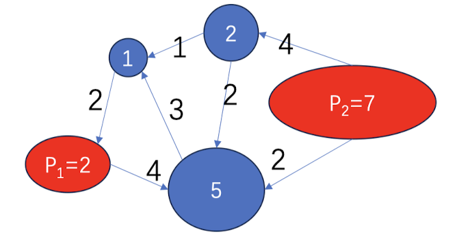
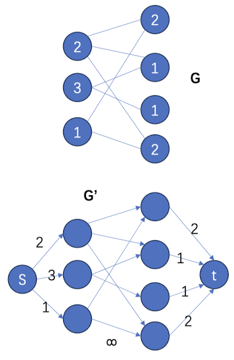

# Chapter-9网络流算法的应用

## Circulation-demand问题

考虑一个地区的交通网络。城市 $\mathrm{i}$ 的需求量为 $\mathrm{d}_{\mathrm{i}}$ ，工厂 $\mathrm{j}$ 有一个最大供应量 $\mathrm{p}_{\mathrm{j}}$ 。每条路有一个容量。可以理解为电力传输/消耗品传输，如何安排生成量及运输使得每个城市的需求均被满足?

如上图所示，红色节点是工厂，蓝色节点是城市。

解法：构图G‘，$s$ 到工厂 $j$ 连一条边, 容量为 $p_j$ 。城市 $\mathrm{i}$ 向汇点 $\mathrm{t}$, 连一条边, 容量为 $\mathrm{d}_{\mathrm{i}}$ 。有一个circulation $\Leftrightarrow$  求出G'的最大流为$\sum d_i$

## 有上下界的可行流问题

给定一个有向图，假定每条边有一个容量上界和容量下界，如何找到一个可行流f？

转换为circulation-demand问题

只有流入的作为“工厂”，只有流出的作为“城市”

## 二分图的最小权覆盖集&最大权独立集

二分图 $G ，$ 每个点 $v$ 有权值 $w(v)$ （可假定都是非负）找最小权覆盖集（点覆盖边）
- 说明：本题的等价问题是找最大权独立集
- 说明：最小点覆盖是本题的特殊情况（权值均为 1 ）

构图G‘

1. 增加源点 $s$, 连接 $s$ 到 X中所有点, 边权是相应点的点权
2. 增加汇点 $t$, 连接 Y中所有点到 $t$, 边权是相应点的点权
3. 对原图中的边，将边权定位无穷大 $\infty$ 。

定理：G的最小点权覆盖$\Leftrightarrow$ G‘的最小割（最大流）

## 有依赖的物品选择问题——最大权闭合图问题

有一堆物品，每个物品用一个顶点 $\mathrm{v}$ 表示, 有一个权值 $w(v)$ （可能为负）。物品之间存在依赖关系；用弧表示； $(i, j)$ 表示 选i 就必须 选 $j$ 。（允许有环）

问题：如何找一个物品集合，符合物品间依赖关系，且总权值最大？即如何求 $\mathrm{G}$ 的最大权的闭合子图A (closure: A出发的边会回到A)

## 寻找最亲密的小团体——最大密度子图问题

对于无向图 $G=(E, V)$ 的每个顶点子集 $X \subseteq V$,

- 令 $E(X)$ 表示 $G$ 中连接 X中顶点的所有边的集合。
- 将 $(\mathrm{X}, \mathrm{E}(\mathrm{X})$ )称作是 $\mathrm{G}$ 的一个诱导子图。也叫做生成子图。（下简称子图）。
- 定义 $|E(X)| /|X|$ 为该子图的密度。

问题：寻找密度最大的子图。$\operatorname{Max}|E(X)| /|X|$ : $X \subseteq \vee 。$

